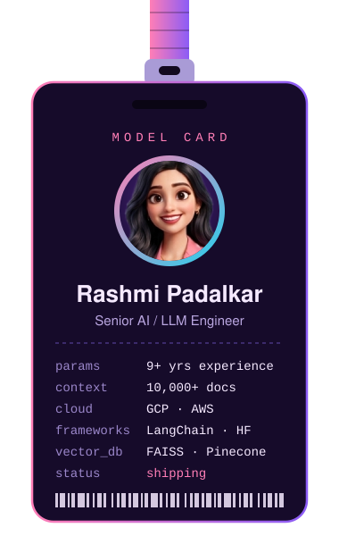
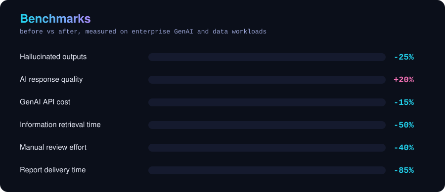
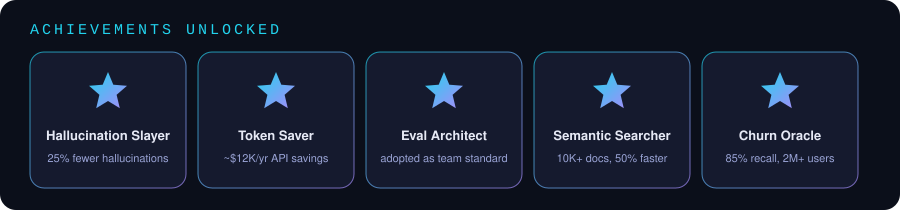
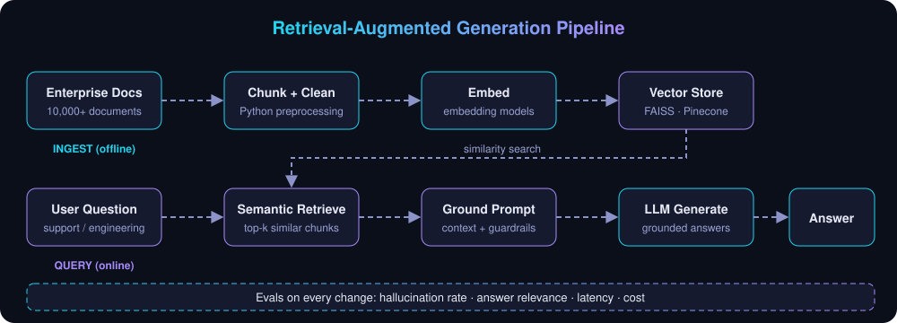
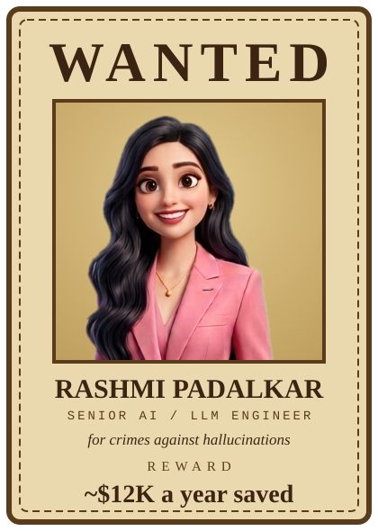

<div align="center">



<a href="https://github.com/rashmi0405">
  
</a>

</div>

<table>
<tr>
<td width="340" valign="top">



</td>
<td valign="top">

### 🧬 About me

**Senior AI / LLM Engineer** with 9+ years across Python, data engineering and Generative AI, currently building RAG pipelines, LLM evaluation harnesses and hallucination checks for a Fortune Tech 10 client through GlobalLogic.

🎓 M.S. Data Science (NYIT) · B.S. Computer Science (University of Pune)
📜 ML Specialization (Andrew Ng / Stanford) · Google Cloud BigQuery & Looker Studio
📝 Published in IJCATR (2019)

🏴‍☠️ Favorite anime: **One Piece** 

### 🧪 My AI Creations

| 🧠 Project | 🎯 What it does | 💻 Tech |
| :-- | :-- | :-- |
| [🖼️ Deep-Learning](https://github.com/rashmi0405/Deep-Learning) | Image recognition with deep neural networks | `Python` `Jupyter` |
| [🤖 Machine-Learning-Project](https://github.com/rashmi0405/Machine-Learning-Project) | Several ML applications: heart disease prediction, bipolar disorder (MDD) classification, alcohol QCM sensor analysis, optimization-based ML, and college admission preferences from student performance (the topic of my published paper) | `Python` `Jupyter` |
| [🔬 Machine-Learning-Mini-Project](https://github.com/rashmi0405/Machine-Learning-Mini-Project) | A focused machine learning mini project | `Python` `Jupyter` |
| [⛏️ Data-Mining-Project](https://github.com/rashmi0405/Data-Mining-Project) | Mining COVID-19 response patterns and case progression across the US | `Python` `Jupyter` |
| [🐘 Big-Data-Project](https://github.com/rashmi0405/Big-Data-Project) | Big data analysis of Amazon best-selling books | `Python` `Jupyter` |
| 🏴‍☠️ **Setting sail** | More LLM, RAG and evaluation projects are in the works | `LLM` `RAG` `Evals` |

These are the foundations my LLM and RAG work grew from.

> 💗 *"I don't prompt and pray. I evaluate."*
> 🏴‍☠️ *Big dream, great crew, grand evals.*

</td>
</tr>
</table>

---

### 📊 Benchmarks, Stats & Graphs

<div align="center">






</div>

---

### 🏗️ How I build RAG

<div align="center">



</div>

Every change is measured against evals for hallucination rate, answer relevance, latency and cost, so decisions come from numbers instead of vibes.

---

### 🧭 Voyage log

<div align="center">



</div>

---

### 💰 Bounty board

<div align="center">



</div>

---

### 🧰 Toolbelt

**GenAI / LLM**


**Languages & ML**


**Data Engineering & Cloud**


**Dashboards & DevOps**


---

### 💬 Prompt playground

```text
user      > What did Rashmi build at GlobalLogic?
assistant > A LangChain RAG pipeline over FAISS and Pinecone that cut
            hallucinated outputs by 25%, plus evaluation harnesses that
            benchmark OpenAI and Hugging Face models on accuracy,
            latency and cost.

user      > Can she shrink my GenAI bill?
assistant > She cut AI API costs by 15% (~$12K a year) by restructuring
            prompts and requests. Probably yes.

user      > How does she know it works?
assistant > She evaluates it. Her review framework became the team
            standard and cut manual checks by 40%.
```

---

### 🐍 Watch the snake eat my contributions

<div align="center">

<picture>
  <source media="(prefers-color-scheme: dark)" srcset="https://raw.githubusercontent.com/rashmi0405/rashmi0405/output/github-snake-dark.svg" />
  <source media="(prefers-color-scheme: light)" srcset="https://raw.githubusercontent.com/rashmi0405/rashmi0405/output/github-snake.svg" />
  
</picture>

</div>

---

### 📫 Let's connect

<div align="center">

[](mailto:rashmipadalkar24@gmail.com)
[](https://www.linkedin.com/in/rashmi-padalkar/)
[](https://github.com/rashmi0405)


*⭐ Always evaluating, always shipping.* 💗

</div>
